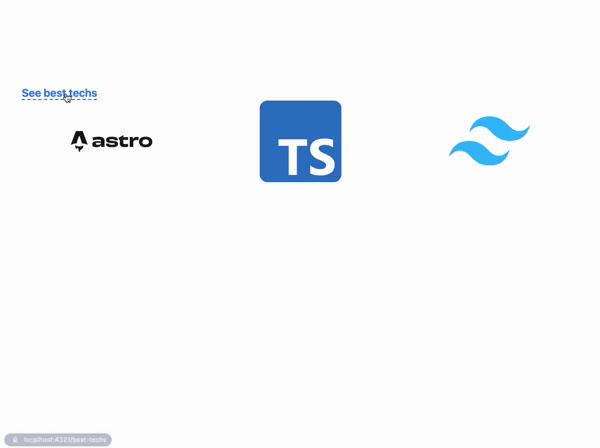

<div align="center">
    <h1>Astro View Transitions</h1>
    
</div>

<br/>

## How it works


In our setup, we will have two pages:
* `/` (index)
* `/best-techs`

On the first page, we will only show three images. But on the next one, these three images will move up and the other will show

We need three steps to accomplish the effect above:

1. `<ViewTransitions/>`
2. Shared component
3. `transition:animate="initial"`

### `<ViewTransitions/>`

This case be easily accomplished by creating a `BaseLayout.astro` and making `index.astro` and `best-techs.astro` using them

### Shared component

Next, between these two pages we must have a **shared component** which we will define our **animation**

In this case, we created the `TechGrid.astro` that receives a list of `ImageMetadata` that contains all data to render an `Image`.

### `transition:animate="initial"`

Finally, by adding `transition:animate="initial"` to the `Image` component, that is "shared" by the two pages, Astro can do its magic

```html
<Image
  ...
  transition:animate="initial"
/>
```

## Dynamic Images

One alternative to access all images dynamically inside of the `assets` folder is to use `Astro.glob`. It automatically detect the file type and `Image` from `astro:assets` requires exactly this type. 

```ts
type ImageGlob = {
  default: ImageMetadata;
};

const images = (
  await Astro.glob<ImageGlob>("../assets/**/*.{png,jpg,jpeg,gif,svg}")
).map((image) => image.default);
```

The `ImageGlob` type is required because the return of `await Astro.glob` puts everything inside of a property called `default`


## References

* https://docs.astro.build/en/guides/view-transitions/
* https://docs.astro.build/en/reference/api-reference/#astroglob
* https://github.com/withastro/astro/blob/main/packages/astro/client.d.ts#L76-L111
